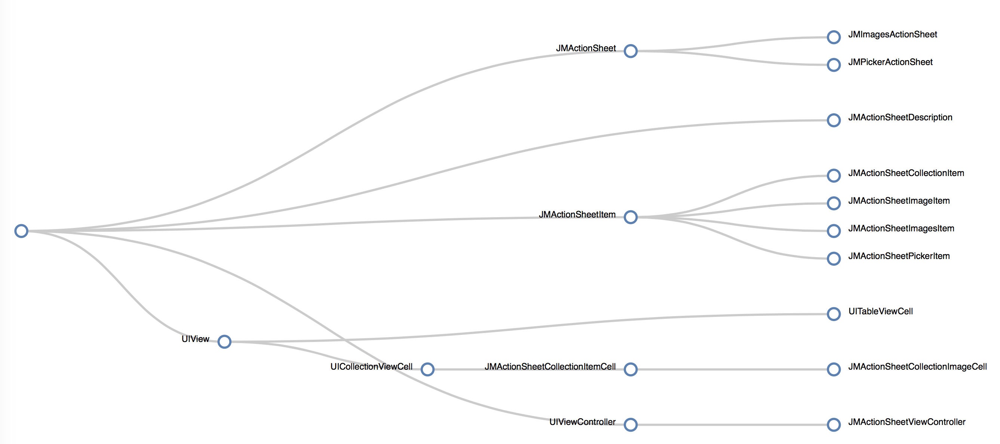

#Generate Obj-C inheritance graph


**usage**
```ruby
./compute_heritage.rb [DIRECTORY]
```

DIRECTORY : is the directory path containing your .m/.h files.

#Generate Obj-C dependency graph
(in progress)